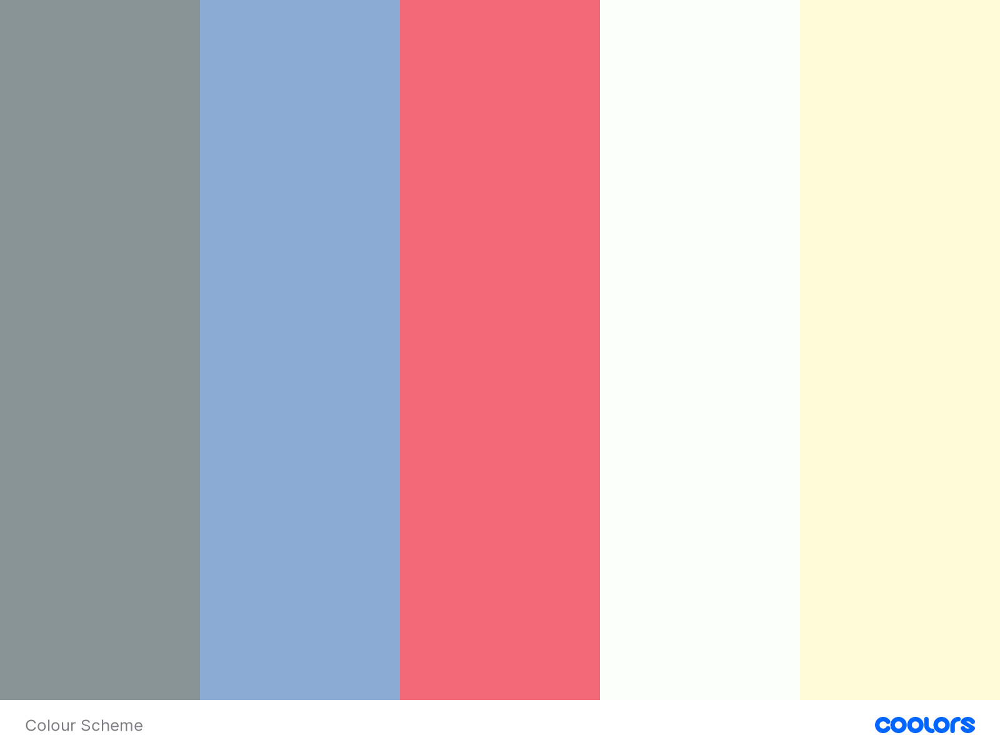

# Personal Resume of Aneesa Khan

\

**Live Page**: https://anee127.github.io/Milestone-Project-1/

**This Resume is part of the first Milestone Project carried out through the Code Institute.**

This website showcases my skills and experience as a personal resume website. It includes some features about me as well as my details and CV to appeal to potential recruiter/employers. The website itself is an example of my skills and I have provided contact input for users who would like to get in touch.

## <u>Table of Contents</u>
- [**User Experience (UX)**](#user-experience-ux)
  + [Purpose](#purpose)
  + [User Stories](#user-stories)
- [Design](#design)
    + [Structure](#structure)
    + [Colour Scheme](#colour-scheme)
    + [Typography](#typography)
    + [Images](#images)
    + [Wireframes](#wireframes)
- [**Features**](#features)
  + [Existing Features](#exsiting-features)
  + [Features left to Include](#features-left-to-include)
- [**Technologies**](#technologies)
  + [Languages](#languages)
  + [Frameworks, Libraries and Programs](#frameworks-libraries-and-programs)
- [**Deployment**](#deployment)
  + [Deploy to Github](#deploy-to-github)
  + [Accessing Code](#accessing-code)
- [**Testing**](#testing)
  + [Testing User Stories](#testing-user-stories)
  + [Validator Checks](#validator-checks)
  + [Responsive Design](#responsive-design)
  + [Additional Testing](#additional-testing)
  + [Bugs](#bugs) 
- [**Credits**](#credits)
  + [Content](#content)
  + [Media](#media)
- [Acknowledgements](#acknowledgements) 
- [**Contact**](#contact)

## **User Experience (UX)**
### Purpose
For this first milestone project the purpose is to create a personal website to showcase my skills and experience to become a full stack software developer, and so that it will give me a chance to be noticed by potential recruiters. 
### User Stories
1.	As a user of a recruiter, I should be able to easily navigate through the website to find relevant information.
2.	As a user of a recruiter, I should be able to use the website on any device without problem. 
3.	As a user of a recruiter, I should be able to find out about the creator on the first page including their contact details. 
4.	As a user of a recruiter, I should be able to read through the creators’ CV and be able to download a copy. 
5.	As a user of a recruiter, I should be able to see their relevant skills.
6.	As a user of a recruiter, I should be able to contact the creator with any message or feedback that I would like to give. 
7.	As a user of a recruiter, I should be able to access links to their social media accounts. 
### Design
- **Structure**
I opted for a basic website design structure with a simple header and footer in the same style, as well as a hero image, all repeated to keep the website minimalistic. 
- **Colour Scheme**
1.	A pastel minimalistic colour scheme in contrast to dark grey text to make is easier to read. 
2.	The key colours being white, grey, blue, pink and yellow.
3.	The colours used tie in with the colours in the hero image to keep the scheme throughout the website.
4.	Most of the background is white to avoid visual clashes and create more emphasis on the text. 

Source: [Coolors](https://coolors.co/879397-89aad2-f36874-fdfffc-fffad7)
- **Typography**
The Poppins font is used throughout the website, it is a rounded and easy to read font. Bold, coloured text is used for emphasis with some words. Sans serif is the backup font in case the original font does not load onto the website. Courgette is used for the web logo only to make it stand out from the rest of the text.
- **Images**
A relevant and simple hero image was used that ties in with the colour scheme. Images were also shown to represent each project on the home page. 
- **Wireframes**
At the start of the project I designed the wireframes using Balsamiq. These initial designs made it easier to plan the responsive design and structure of the website. 
[Wireframes link] (assets/pdf/MilestoneProject1Wireframes.pdf)

## Features
### Existing Features
- **Header**
Navbar: used bootstrap to create a responsive navbar with my name as the logo which will contain a link to the ‘About’ page. The navbar is fixed to the top of the page as the user scrolls down and will be the same across all the pages. 
On standard and larger screens, the navbar menu will be shown as: About, CV and Contact, consecutively.
For medium and smaller screens, the menu items will be within a hamburger icon button displaying as: About, CV and Contact, in a descending order below the logo.
- **Sections**
About page: This contains a brief introduction to myself, my contact details and links to my projects. 
CV page: Has a timeline of my education and work experience as well as progress bars to represent my skills. 
Contact page: this contains a form in which a user can provide their contact information and a message that can be submitted to myself. 
- **Footer**
The footer has my copyright information, a download link to a printable pdf link of my cv and links to my social media that will all open in a new page. 
### Features Left to Include
I will be using this site to promote myself in the future so will update the CV and skills section when required. I will also update the ‘My Projects’ section to include more recent and better projects but will keep the same layout and just include them towards the bottom. Once I have more than 6 projects, I will create a whole page just for them and provide a link on the homepage. I will also make the contact page fully useable where the messages will be sent straight to my inbox. 

## Technologies Used
### Languages
-	HTML5
-	CSS3
### Frameworks, Libraries and Programmes
-	Bootstrap4
-	Fontawesome
-	Github
-	Gitpod
-	Visual Studio Code
-	Balsamiq
-	Google Fonts
-	Coolors 
## deployment

### deploy-to-github
1. Log in to GitHub and locate the GitHub Repository. 
2. At the top of the Repository (not top of page), locate the "Settings" button on the menu. 
3. Scroll down the Settings page until you locate the "GitHub Pages" Section.
4. Under "Source", click the dropdown called "None" and select "Master Branch".
5. The page will automatically refresh.
6. Scroll back down through the page to locate the now published site link in the "GitHub Pages" section.
[Link] ()
- **Forking the GitHub Repository**
  Forking allows you to create a copy of the original repository and propose changes to the repository owner via a pull request. 
    1. Log in to GitHub and locate the GitHub Repository
    2. At the top of the Repository (not top of page) just above the "Settings" button on the menu, locate the "Fork" button.
3. You should now have a copy of the original repository in your GitHub account.
- **Cloning Repository**
1. Navigate to [repository](https://github.com/anee127/milestone-project-1).
2. Click Code located over the files.
3. Select how you want to create the local repo.
4. Copy the url.
5. Open Terminal.
6. Change directory to where you want the repo to be.
7. type "git clone" followed by the url copied in step 4.
8. Enter, and a Local repo is created.
## testing

### testing-user-stories
1. **To be able to easily navigate throughout the site to find the desired content**
- Upon entering the site, users are automatically greeted with a simple structured homepage which is the header throughout all pages of the site.
-  The header features an easily readable navigation bar to go to the page of their choice.
- Footer content is consistent throughout all pages.
2. **Ability to access a hard copy of my CV**
- 'Resume' link on the menu bar which is a direct link to download a hard copy of my CV.
- Visible on every page of the website.
- Opens up my CV in a new tab in the browser so the user won't lose their place on the site.
3. **To view my portfolio of work**
- 'My work' link on the menu bar to access the page with my latest projects.
- Carousel used to display projects and create user interaction with carousel indicators and control arrows.
- Overlay text to provide project summary.
- Button link to give user option to view the full project in another browser. 
  - Projects 1-3 are linked to mini-projects created during the course walkthroughs, but project 4-5 are just dummy images linking to my GitHub account.
4. **Ability to contact me**
- 'Contact me' link on the menu bar to page with direct contact form.
- Hover over map marker (homepage navigation link) to view my address.
- Phone number and email included on 'My story' page.
- Contact details also accessible on the hard copy of cv.
5. **View my current skills and experience**
- 'My story' link on the menu bar to access a page with my current skills and experience.
- This can also be found on the hard copy of CV.
6. **Access links to my external social accounts**
- At the bottom of each page, there is a footer which contains links to my social platforms which is consistent throughout all pages.
### Validator-checks
The W3C Markup Validator and W3C CSS Validator Services were used to validate every page of the project to ensure there were no syntax errors in the project. Code was entered through direct input.

- [**HTML Validator**](https://validator.w3.org/nu/#textarea)

  No errors or warning messages were received;

- [**CSS Validator**](https://jigsaw.w3.org/css-validator/#validate_by_input)

  Two errors occured for the CSS and several warnings. 

### Additional-testing
The Website was tested on Google Chrome, Firefox and Safari browsers.

- The website was tested on a number of devices including a Laptop, Desktop, iPad, iPhone (5, 6, X) and Samsung Note 10.

- I recieved plenty of suggestions from friends and family to improve user experience: 
    - The original font used for the logo was pointed out to be too childish, so I changed it to a fancier font.
    - The Project titles were placed in the middle of each image with some css changes for contrast between text and images. 
    - The hero text was put into a translucent box in the middle of the hero image to stand out more and make it easier to read.  
- My project was posted on Slack to recieve some feedback from other students.

## Bugs
1. The hero image used initially caused the whole website to load really slowly so I had to compress the image to make the file size smaller but so that the resolution of the image does not change drastically. I used [Reduce Images](https://www.reduceimages.com/) to make the image smaller which resolved the problem. 
2. The hamburger icon for the menu was not functioning at first and found that it was because I did not have JQuery script in my code. I found the links needed by searching JQuery for navbar. 
3. 
## Credits
### Content
- Bootstrap 4.5: Bootstrap Library used throughout the project, components used include the navbar, grid system, timeline and form templates. [Botstrap4](https://getbootstrap.com/)
- [Code Institute's](https://codeinstitute.net/) 
- [W3schools.com](https://www.w3schools.com/): 

### Media
- hero image was taken from [freepik]( https://www.freepik.com)
- The mock-up image provided at the top of the README.md was created using [About Am I Responsive](http://ami.responsivedesign.is/)
## Acknowledgements
- My Mentor for continuous help and support throughout the project.
- The [Code Institute](https://codeinstitute.net/) Slack Community.
- A friend who has given me continuous support throughout the project.
## Contact
- Created by @aneesakhan
- Contact: aneesa.khan97@outlook.com

